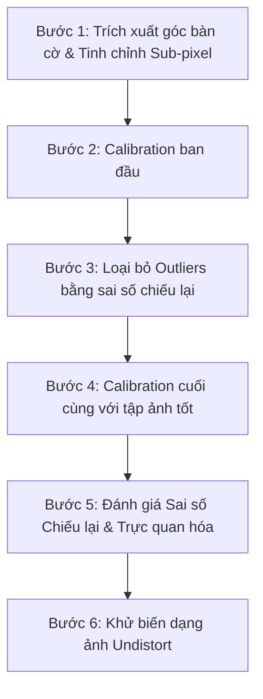

# Tài liệu Kỹ thuật & Cơ sở Lý thuyết Camera Calibration (Phương pháp Zhang Zhengyou)

Tài liệu này trình bày toàn bộ cơ sở lý thuyết, mô hình toán học và các công thức chi tiết được sử dụng trong dự án căn chỉnh camera (Camera Calibration) bằng phương pháp **Zhang Zhengyou** (1999) kết hợp với các thuật toán tối ưu hóa trong thư viện OpenCV.

---

## 1. Mô hình Camera Lỗ Kim (Pinhole Camera Model)

Mô hình camera lỗ kim biểu diễn mối quan hệ hình học giữa một điểm $M$ trong không gian 3D thế giới thực và điểm ảnh chiếu tương ứng $m$ của nó trên mặt phẳng cảm biến 2D thông qua phép chiếu phối cảnh.

```
       Z_c
        ^
        |   . M (X_w, Y_w, Z_w)
        |  /
        | /
        |v
      (O_c)----------> X_c
       / \
      /   \
     /     v m (u, v) [Mặt phẳng ảnh]
    v
   Y_c
```

### 1.1. Phương trình chiếu phối cảnh tổng quát
Mối quan hệ này được mô tả dưới dạng tọa độ thuần nhất (homogeneous coordinates) như sau:

$$s \tilde{m} = K [R \mid t] \tilde{M}$$

Trong đó:
*   $\tilde{M} = [X_w, Y_w, Z_w, 1]^T$ là tọa độ thuần nhất của điểm trong hệ quy chiếu thế giới (World coordinate).
*   $\tilde{m} = [u, v, 1]^T$ là tọa độ thuần nhất của điểm ảnh tương ứng trên cảm biến (Pixel coordinate).
*   $s$ là một hệ số tỷ lệ phi không (scale factor).
*   $[R \mid t]$ là ma trận tham số ngoại tại (Extrinsic parameters matrix).
*   $K$ là ma trận tham số nội tại (Intrinsic matrix).

---

### 1.2. Ma trận Tham số Nội tại (Intrinsic Matrix $K$)
Ma trận $K$ đặc trưng cho các thuộc tính quang học bên trong của camera:

$$K = \begin{bmatrix} f_x & \gamma & c_x \\ 0 & f_y & c_y \\ 0 & 0 & 1 \end{bmatrix}$$

Trong hầu hết các hệ thống camera hiện đại, trục pixel vuông góc nên hệ số lệch $\gamma$ (skew factor) bằng $0$:

$$K = \begin{bmatrix} f_x & 0 & c_x \\ 0 & f_y & c_y \\ 0 & 0 & 1 \end{bmatrix}$$

*   $f_x, f_y$: Tiêu cự (focal length) của camera được biểu diễn theo đơn vị pixel dọc theo trục $X$ và $Y$.
    $$f_x = \frac{f}{dx}, \quad f_y = \frac{f}{dy}$$
    *(với $f$ là tiêu cự thực tế (mm), và $dx, dy$ là kích thước vật lý của một pixel trên cảm biến).*
*   $c_x, c_y$: Tọa độ của điểm quang tâm (principal point / optical center) trên ảnh, biểu diễn theo pixel.

---

### 1.3. Ma trận Tham số Ngoại tại (Extrinsic Parameters $[R \mid t]$)
Mô tả phép biến đổi tọa độ từ hệ quy chiếu thế giới (World) sang hệ quy chiếu camera (Camera):

$$\begin{bmatrix} X_c \\ Y_c \\ Z_c \end{bmatrix} = R \begin{bmatrix} X_w \\ Y_w \\ Z_w \end{bmatrix} + t$$

*   $R$ là ma trận xoay 3D kích thước $3 \times 3$ (Rotation matrix) thuộc nhóm trực giao đặc biệt $SO(3)$, có tính chất:
    $$R^T R = I, \quad \det(R) = 1$$
    Trong code [calibrate_helper.py](file:///c:/Users/KHANH/Documents/GitHub/Calibration-ZhangZhengyou-Method/calibrate_helper.py), ma trận xoay được biểu diễn dưới dạng vector xoay 3D $\vec{r} = [r_x, r_y, r_z]^T$ để tiết kiệm tham số và dễ tối ưu hóa. Mối quan hệ giữa vector xoay và ma trận xoay được chuyển đổi thông qua **Công thức Rodrigues**:
    $$\theta = \|\vec{r}\|_2, \quad \vec{n} = \frac{\vec{r}}{\theta}$$
    $$R = I + \sin\theta [\vec{n}]_\times + (1 - \cos\theta) [\vec{n}]_\times^2$$
    *(với $[\vec{n}]_\times$ là ma trận phản đối xứng của vector đơn vị $\vec{n}$).*
*   $t = [t_x, t_y, t_z]^T$ là vector tịnh tiến 3D (Translation vector).

---

## 2. Phương pháp Căn chỉnh của Zhang Zhengyou

Phương pháp của Zhang Zhengyou sử dụng một tấm lưới phẳng phẳng (như bàn cờ checkerboard) được chụp ở các góc độ và khoảng cách khác nhau.

### 2.1. Phép biến đổi Homography phẳng
Vì bàn cờ là một mặt phẳng, ta có thể tự do định nghĩa hệ tọa độ thế giới sao cho mặt phẳng bàn cờ nằm tại $Z_w = 0$. Khi đó, phương trình chiếu phối cảnh thu gọn lại thành:

$$s \begin{bmatrix} u \\ v \\ 1 \end{bmatrix} = K \begin{bmatrix} r_1 & r_2 & r_3 & t \end{bmatrix} \begin{bmatrix} X_w \\ Y_w \\ 0 \\ 1 \end{bmatrix} = K \begin{bmatrix} r_1 & r_2 & t \end{bmatrix} \begin{bmatrix} X_w \\ Y_w \\ 1 \end{bmatrix}$$

Đặt $H$ là ma trận Homography phẳng kích thước $3 \times 3$:

$$H = K \begin{bmatrix} r_1 & r_2 & t \end{bmatrix} = \begin{bmatrix} h_1 & h_2 & h_3 \end{bmatrix}$$

Khi đó:

$$s \tilde{m} = H \tilde{M}' \quad \text{với} \quad \tilde{M}' = [X_w, Y_w, 1]^T$$

Ma trận Homography $H$ có thể được tính toán cho mỗi bức ảnh bằng cách giải hệ phương trình tuyến tính từ các điểm tương ứng giữa tọa độ thực tế bàn cờ và tọa độ điểm góc phát hiện trên ảnh.

---

### 2.2. Ràng buộc toán học lên tham số nội tại (Orthogonality Constraints)
Vì $r_1$ và $r_2$ là các cột của ma trận xoay trực giao $R$, chúng phải thỏa mãn hai tính chất cơ bản:
1.  Chúng trực giao với nhau: $r_1^T r_2 = 0$
2.  Chúng có độ dài chuẩn hóa bằng nhau: $\|r_1\| = \|r_2\| = 1$

Từ định nghĩa $H = K \begin{bmatrix} r_1 & r_2 & t \end{bmatrix}$, ta suy ra:
$$r_1 = K^{-1} h_1 \quad \text{và} \quad r_2 = K^{-1} h_2$$

Thế vào các điều kiện trực giao, ta được hai phương trình ràng buộc cơ bản cho mỗi ảnh:

$$h_1^T K^{-T} K^{-1} h_2 = 0$$

$$h_1^T K^{-T} K^{-1} h_1 = h_2^T K^{-T} K^{-1} h_2$$

Đây là các phương trình chứa ma trận đối xứng dương $B = K^{-T} K^{-1}$ (được gọi là ảnh của đường tròn tuyệt đối - Absolute Conic). Ma trận $B$ có 6 tham số độc lập. Với mỗi ảnh calib, ta thu được 2 ràng buộc tuyến tính đối với $B$. Do đó, cần tối thiểu 3 ảnh chụp ở các tư thế khác nhau để giải hệ phương trình và tìm ra $B$, từ đó phân rã Cholesky để tính ra ma trận tham số nội tại $K$.

---

### 2.3. Tối ưu hóa phi tuyến (Non-linear Refinement)
Lời giải tuyến tính thu được ở trên chưa tính đến nhiễu ảnh và biến dạng quang học. Do đó, bước cuối cùng là sử dụng thuật toán **Levenberg-Marquardt** để tối ưu hóa đồng thời cả tham số nội tại, tham số ngoại tại và hệ số biến dạng bằng cách cực tiểu hóa sai số chiếu lại (Reprojection Error):

$$\min_{K, D, R_i, t_i} \sum_{i=1}^{n} \sum_{j=1}^{m} \| m_{i,j} - \hat{m}(K, D, R_i, t_i, M_j) \|^2$$

Trong đó:
*   $m_{i,j}$ là tọa độ góc bàn cờ phát hiện được trên ảnh $i$ tại điểm thứ $j$.
*   $\hat{m}(K, D, R_i, t_i, M_j)$ là điểm chiếu lý thuyết nhận được bằng cách chiếu điểm thế giới $M_j$ thông qua các tham số đang tối ưu.

---

## 3. Mô hình Biến dạng Ống kính (Lens Distortion Model)

Ánh sáng đi qua thấu kính thực tế luôn bị bẻ cong không hoàn hảo. Mô hình biến dạng được chia làm hai loại chính:

### 3.1. Biến dạng Hướng tâm (Radial Distortion)
Xảy ra do hình dạng cong của thấu kính, làm các tia sáng ở rìa thấu kính bị khúc xạ nhiều hoặc ít hơn so với trung tâm.
Điểm chuẩn hóa chưa biến dạng:
$$x = \frac{X_c}{Z_c}, \quad y = \frac{Y_c}{Z_c}$$
Đặt $r^2 = x^2 + y^2$. Công thức hiệu chỉnh biến dạng hướng tâm:

$$x_{\text{radial}} = x (1 + k_1 r^2 + k_2 r^4 + k_3 r^6)$$

$$y_{\text{radial}} = y (1 + k_1 r^2 + k_2 r^4 + k_3 r^6)$$

*   $k_1, k_2, k_3$: Các hệ số biến dạng hướng tâm (Radial distortion coefficients).
*   Nếu $k_1 > 0$: Biến dạng kiểu phao (Barrel distortion - phình ra ngoài).
*   Nếu $k_1 < 0$: Biến dạng kiểu gối (Pincushion distortion - lõm vào trong).

---

### 3.2. Biến dạng Tiếp tuyến (Tangential Distortion)
Xảy ra khi thấu kính không được đặt song song hoàn hảo với mặt phẳng cảm biến ảnh trong quá trình lắp ráp.

$$x_{\text{tangential}} = x + [2 p_1 x y + p_2 (r^2 + 2 x^2)]$$

$$y_{\text{tangential}} = y + [p_1 (r^2 + 2 y^2) + 2 p_2 x y]$$

*   $p_1, p_2$: Các hệ số biến dạng tiếp tuyến (Tangential distortion coefficients).

---

### 3.3. Phương trình Biến dạng Tổng hợp
Tọa độ điểm ảnh sau khi chịu tác động của cả hai loại biến dạng trên:

$$x_{\text{distorted}} = x (1 + k_1 r^2 + k_2 r^4 + k_3 r^6) + 2 p_1 x y + p_2 (r^2 + 2 x^2)$$

$$y_{\text{distorted}} = y (1 + k_1 r^2 + k_2 r^4 + k_3 r^6) + p_1 (r^2 + 2 y^2) + 2 p_2 x y$$

Tọa độ pixel thực tế trên ảnh thu được bằng cách nhân với ma trận nội tại $K$:

$$u = f_x x_{\text{distorted}} + c_x$$

$$v = f_y y_{\text{distorted}} + c_y$$

Hệ số biến dạng của camera được OpenCV trả về dưới dạng vector:
$$D = [k_1, k_2, p_1, p_2, k_3]$$

---

## 4. Hiện thực hóa Thuật toán trong Mã nguồn (Implementation)

Hệ thống xử lý trong dự án này được viết trong lớp `Calibrator` tại file [calibrate_helper.py](file:///c:/Users/KHANH/Documents/GitHub/Calibration-ZhangZhengyou-Method/calibrate_helper.py). Quy trình chạy gồm 6 bước chính:



### Bước 1: Phát hiện góc bàn cờ và Tinh chỉnh Sub-pixel
*   **Hàm thực thi:** `self.detect_corners(gray)` ([calibrate_helper.py:L74-110](file:///c:/Users/KHANH/Documents/GitHub/Calibration-ZhangZhengyou-Method/calibrate_helper.py#L74-110))
*   Sử dụng thuật toán tìm kiếm góc thông minh Sector-Based `cv2.findChessboardCornersSB`.
*   Sử dụng thuật toán toán học `cv2.cornerSubPix` để tìm vị trí tọa độ thực tế của các góc ảnh đạt độ chính xác dưới mức pixel (sub-pixel accuracy). Nguyên lý dựa trên cực tiểu hóa tích vô hướng gradient ảnh tại vùng lân cận $N$:
    $$\sum_{i \in N} \nabla I(q_i)^T (q_i - p) = 0$$
    với $p$ là vị trí góc cần tinh chỉnh và $q_i$ là các điểm lân cận.

---

### Bước 2: Căn chỉnh ban đầu (Initial Calibration)
*   **Hàm thực thi:** `cv2.calibrateCamera` ([calibrate_helper.py:L227-235](file:///c:/Users/KHANH/Documents/GitHub/Calibration-ZhangZhengyou-Method/calibrate_helper.py#L227-235))
*   Đầu vào là tập hợp các điểm thế giới 3D lý thuyết `points_world` và điểm ảnh 2D thực tế `points_pixel`.
*   Đầu ra thu được ước lượng sơ bộ của $K$, $D$ cùng các vector ngoại tại $R_i, t_i$ cho từng bức ảnh.

---

### Bước 3: Loại bỏ Outliers (Outlier Rejection)
*   **Phương pháp:** Kiểm tra sai số chiếu lại của từng ảnh.
*   Với mỗi bức ảnh, ta chiếu điểm 3D ngược lại ảnh thông qua các tham số ước lượng ở Bước 2 bằng hàm `cv2.projectPoints`.
*   Tính khoảng cách Euclid giữa điểm thực tế phát hiện được $m_{j}$ và điểm chiếu lại $\hat{m}_{j}$:
    $$\text{mean\_err} = \frac{1}{N} \sum_{j=1}^{N} \| m_{j} - \hat{m}_{j} \|_2$$
*   Nếu bức ảnh nào có `mean_err` lớn hơn `outlier_threshold` (mặc định là `3.0` pixels), ảnh đó sẽ bị loại bỏ khỏi tập căn chỉnh cuối cùng nhằm loại bỏ nhiễu nặng do rung lắc hoặc mờ nhòe.

---

### Bước 4: Căn chỉnh cuối cùng (Final Calibration)
*   **Hàm thực thi:** `cv2.calibrateCamera` ([calibrate_helper.py:L299-307](file:///c:/Users/KHANH/Documents/GitHub/Calibration-ZhangZhengyou-Method/calibrate_helper.py#L299-307))
*   Thực hiện chạy lại thuật toán trên tập ảnh chất lượng đã được lọc sạch ở Bước 3.
*   Cập nhật các thuộc tính của đối tượng: `self.mat_intri` ($K$), `self.coff_dis` ($D$), `self.v_rot` ($R$) và `self.v_trans` ($t$).

---

### Bước 5: Đánh giá Sai số Chiếu lại & Trực quan hóa
Hệ thống tính toán 3 chỉ số sai số chính dựa trên khoảng cách Euclid:
1.  **Sai số Trung bình (Mean Reprojection Error):**
    $$\text{Mean Error} = \frac{1}{N \cdot M} \sum_{i=1}^{M} \sum_{j=1}^{N} \| e_{i,j} \|_2$$
2.  **Sai số Trung bình Bình phương (RMS Reprojection Error):**
    $$\text{RMS Error} = \sqrt{\frac{1}{N \cdot M} \sum_{i=1}^{M} \sum_{j=1}^{N} \| e_{i,j} \|_2^2}$$
3.  **Độ lệch Vector (dx, dy):**
    $$\Delta x_{i,j} = u_{real} - u_{projected}, \quad \Delta y_{i,j} = v_{real} - v_{projected}$$

#### Các biểu đồ trực quan được vẽ bằng Matplotlib:
*   **Biểu đồ cột (Bar Chart):** Biểu diễn sai số chiếu lại trung bình trên từng tấm ảnh đơn lẻ giúp đánh giá chất lượng của từng góc chụp.
*   **Biểu đồ phân tán lỗi (Scatter Plot):** Biểu diễn phân phối $(\Delta x, \Delta y)$ của sai số pixel giúp phát hiện xem có sự lệch phân bố (bias) theo một hướng cụ thể nào không.
*   **Biểu đồ véc-tơ lỗi (Quiver Plot Trace-back):** Vẽ trực tiếp các vector lỗi phóng đại dạng mũi tên lên từng góc của các bức ảnh calib thực tế để thấy rõ hướng và độ lớn sai số cục bộ.
*   **Heatmap sai số góc bàn cờ (Chessboard Error Heatmap):** Tổng hợp sai số trung bình tại từng vị trí ô lưới trên bàn cờ phẳng qua tất cả các ảnh để kiểm tra xem camera có xu hướng bị sai số cao ở khu vực nào (thường là ở 4 góc rìa ảnh do hiệu ứng méo ống kính cực đại).

---

### Bước 6: Khử biến dạng ảnh (Undistort)
*   **Hàm thực thi:** `self.undistort_images(...)` ([calibrate_helper.py:L916-998](file:///c:/Users/KHANH/Documents/GitHub/Calibration-ZhangZhengyou-Method/calibrate_helper.py#L916-998))
*   Đầu tiên sử dụng `cv2.getOptimalNewCameraMatrix` với tham số $\alpha = 0$. Hàm này tính toán lại ma trận nội tại mới $K_{\text{new}}$ tối ưu để loại bỏ toàn bộ các vùng pixel đen (black border) sinh ra do quá trình kéo giãn khử méo hình:
    $$\text{ROI} = (x, y, w_{roi}, h_{roi})$$
*   Sử dụng `cv2.undistort` để ánh xạ ngược từng tọa độ pixel ảnh nguồn bị biến dạng về ảnh đích phẳng sạch méo bằng cách giải phương trình toán học ở phần 3.3.
*   Thực hiện cắt lát ảnh theo vùng hộp giới hạn ROI `dst[y:y+rh, x:x+rw]` thu được ảnh kết quả sắc nét, trực quan và phẳng tuyệt đối.

---

## 5. Bảng tổng hợp các Ký hiệu Toán học

| Ký hiệu | Ý nghĩa hình học / Vật lý | Vai trò trong Code |
| :--- | :--- | :--- |
| $K$ (hoặc $A$) | Ma trận chứa tiêu cự và quang tâm | `self.mat_intri` (kích thước $3 \times 3$) |
| $D$ (hoặc `dist`) | Các hệ số biến dạng thấu kính | `self.coff_dis` (vector 5 phần tử) |
| $R$ / $\vec{r}$ | Phép xoay từ hệ tọa độ thế giới sang hệ camera | `self.v_rot` (dạng Rodrigues vector $3 \times 1$) |
| $t$ | Phép dịch chuyển tịnh tiến 3D giữa camera và bàn cờ | `self.v_trans` (vector tịnh tiến $3 \times 1$) |
| $M$ | Tọa độ điểm thực tế trên bàn cờ phẳng ($Z=0$) | `self.cp_world` (tọa độ $X, Y, 0$ thực tế mét) |
| $m$ | Tọa độ pixel phát hiện được trên mặt phẳng ảnh cảm biến | `points_pixel` (tọa độ $u, v$ pixel) |
| $\hat{m}$ | Điểm ảnh lý thuyết được chiếu từ không gian 3D | Đầu ra của `cv2.projectPoints` |
| $\text{RMS}$ | Sai số căn chỉnh tổng thể | Tham số `rms` (đơn vị pixel) |
